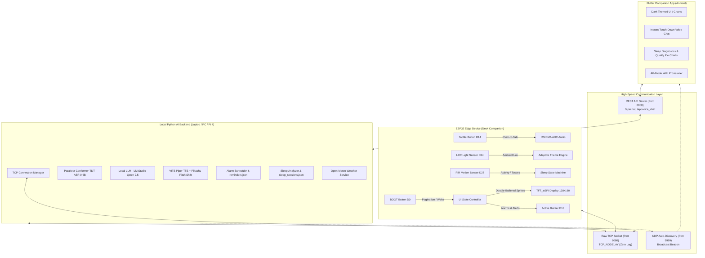

# ⚡ Table-Bondhu — AI Desk Companion & Smart IoT Sleep Assistant

<div align="center">


**An intelligent ESP32 & Flutter-powered AI desk companion with local Edge AI, real-time voice chat, dynamic avatars, adaptive lighting, smart reminders, focus timers, and intelligent sleep monitoring.**

[](LICENSE)
[](gemini_LLM_btn/)
[](table_bondhu_app/)
[](agentic_companion.py)
[](models/)

</div>

---

## 📖 Table of Contents

1. [Overview](#-overview)
2. [Project Gallery & Features in Action](#-project-gallery--features-in-action)
3. [System Architecture](#-system-architecture)
4. [Key Features](#-key-features)
5. [Hardware Bill of Materials (BOM) & Pinout](#-hardware-bill-of-materials-bom--pinout)
6. [Repository & Directory Structure](#-repository--directory-structure)
7. [Getting Started & Installation](#-getting-started--installation)
   - [Prerequisites](#prerequisites)
   - [1. Backend Server Setup](#1-backend-server-setup)
   - [2. ESP32 Firmware Flashing](#2-esp32-firmware-flashing)
   - [3. Flutter Mobile App Setup](#3-flutter-mobile-app-setup)
8. [Voice Interaction & Control Commands](#-voice-interaction--control-commands)
9. [Mobile App Ecosystem](#-mobile-app-ecosystem)
10. [Authors & Academic Acknowledgments](#-authors--academic-acknowledgments)

---

## 🌟 Overview

**Table-Bondhu** (_Desk Friend_) is an end-to-end IoT and Embedded AI device designed to sit on your desk as an interactive companion. It merges physical hardware (ESP32 microcontroller, 128x160 ST7735 SPI TFT display, tactile inputs, I2S ADC audio sensing, PIR motion detection, and LDR light sensing) with a high-performance local AI backend and a companion mobile app.

Unlike traditional cloud-bound IoT assistants, Table-Bondhu is built around **privacy-first, local-first intelligence**:

- **Offline Speech Recognition (ASR)**: NVIDIA Parakeet TDT 0.6B running locally via ONNX Runtime.
- **Local Large Language Model (LLM)**: Quantized Qwen-2.5-Coder-1.5B running via LM Studio with dynamic tag extraction.
- **Offline Text-to-Speech (TTS)**: VITS Piper neural voice synthesizer with custom real-time Pikachu pitch modulation (+40% pitch/speed shift).
- **Edge UI & Sprite Engine**: 60 FPS double-buffered sprite animations on ESP32 with multi-page word-wrapping speech bubbles and ambient light-reactive themes.

---

## 📸 Project Gallery & Features in Action

<table>
  <tr>
    <td align="center" width="50%">
      
      <br/>
      <b>🕒 Real-Time Clock & Weather HUD</b>
      <p><i>NTP-synchronized clock, live Open-Meteo weather updates, and animated Pikachu idle face.</i></p>
    </td>
    <td align="center" width="50%">
      
      <br/>
      <b>💬 Voice Interaction & Paginated Speech</b>
      <p><i>Push-to-talk voice AI with real-time word-wrapped speech bubbles and talking avatar animations.</i></p>
    </td>
  </tr>
  <tr>
    <td align="center" width="50%">
      
      <br/>
      <b>⏰ Reminders & Alarms Display</b>
      <p><i>Natural language reminders with persistent storage, auto-firing buzzer alarms, and list views.</i></p>
    </td>
    <td align="center" width="50%">
      
      <br/>
      <b>⏳ Dedicated Focus Countdown Timer</b>
      <p><i>Pomodoro & study countdown timer with physical/voice pause, resume, and cancellation controls.</i></p>
    </td>
  </tr>
  <tr>
    <td align="center" width="50%">
      
      <br/>
      <b>🔔 Timer Completion Alert</b>
      <p><i>Flashing visual alert with active buzzer tones when focus countdown reaches zero.</i></p>
    </td>
    <td align="center" width="50%">
      
      <br/>
      <b>🌙 Smart Sleep Tracker & Night Display</b>
      <p><i>PIR motion density + LDR dark detection state machine for non-intrusive sleep hygiene logging.</i></p>
    </td>
  </tr>
</table>

---

## 🏗 System Architecture



---

## ✨ Key Features

### 🎙️ Local Voice AI & Natural Conversation

- **Instant Push-to-Talk**: Hold D14 to stream 16kHz PCM audio over TCP; release to process.
- **Offline ASR**: Fast speech-to-text inference with NVIDIA Parakeet Conformer-TDT (0.6B).
- **Intelligent Response Generation**: LM Studio Qwen-2.5-Coder keeps answers concise ($\le 15$ words) for optimal readability on small screens while extracting commands like `[CMD:ADD_REMINDER|...]`, `[CMD:START_TIMER|...]`, etc.
- **Pikachu Voice FX**: Neural VITS synthesis modulated with $+40\%$ pitch and speed shift for a playful companion personality.

### 📅 Smart Reminders, Alarms & Focus Timers

- **Natural Language Parsing**: Supports relative times (`in 10 minutes`, `in 2 hours`) and absolute times (`at 4:30 PM`, `tomorrow 9am`).
- **Persistent Storage**: All reminders saved in thread-safe JSON format.
- **Countdown Timer**: Built-in Pomodoro/study timer with on-screen visual countdown, voice pause/resume/cancel, and buzzer alarm.

### 😴 Intelligent Sleep Monitoring & Diagnostics

- **Multi-Sensor Sleep State Machine**: Automatically detects sleep when the room is dark (LDR $< 500$) and motion is minimal (PIR density analysis over 30s sliding window) during configurable sleep windows (e.g., 10 PM – 10 AM).
- **Toss & Movement Tracking**: Tracks nighttime restless movements and audio noise events without keeping invasive cameras in your bedroom.
- **Post-Sleep Morning Briefing**: Displays a **Sleep/Nap Summary** directly on the TFT display upon waking up with duration, toss count, and hygiene score.
- **Rich Mobile Analytics**: Visual sleep trends, duration line graphs, quality distribution pie charts, and actionable bedtime hygiene advice in the mobile app.

### 🎨 Adaptive Display & Multi-Avatar Sprites

- **LDR Ambient Light Adaptation**: 4 dynamic color themes based on room lighting (Night, Dusk, Autumn, Bright).
- **Dual Avatars**: Switchable themes between **Pikachu** and **Girl** avatars with blinking, talking mouth movement, waving, and peeping animations.
- **Anti-Flicker Double Buffering**: Smooth rendering with `TFT_eSprite` memory buffers.

---

## 🔌 Hardware Bill of Materials (BOM) & Pinout

### Components Required

| Component                | Specification                                 | Quantity |
| :----------------------- | :-------------------------------------------- | :------- |
| **ESP32 Dev Board**      | NodeMCU ESP-WROOM-32 / 30-Pin / 38-Pin        | 1        |
| **TFT Display**          | 1.8" or 1.77" 128x160 SPI ST7735 / ST7789     | 1        |
| **Microphone Input**     | Internal ADC (GPIO 32) with DC filter circuit | 1        |
| **PIR Motion Sensor**    | HC-SR501 / AM312 Motion Detector              | 1        |
| **Light Sensor (LDR)**   | Photoresistor + 10kΩ pull-down resistor       | 1        |
| **Tactile Push Button**  | Push-to-talk button                           | 1        |
| **Buzzer**               | 5V Active Buzzer                              | 1        |
| **Chassis / Breadboard** | Custom 3D-printed enclosure or breadboard     | 1        |

### GPIO Pin Assignment Table

| ESP32 Pin         | Connected Hardware           | Function / Protocol                             |
| :---------------- | :--------------------------- | :---------------------------------------------- |
| **GPIO 32**       | Mic Input (ADC1_CH4)         | I2S DMA Analog Audio Capture (16kHz 16-bit)     |
| **GPIO 14**       | Push-to-Talk Button          | Active LOW (INPUT_PULLUP)                       |
| **GPIO 0 (BOOT)** | Built-in Button              | Text Pagination / Force Wake / AP Config        |
| **GPIO 27**       | PIR Motion Sensor            | Digital Input (Motion Trigger & Sleep Tracking) |
| **GPIO 34**       | LDR Photoresistor (ADC1_CH6) | Analog Input (0-4095 Ambient Light Level)       |
| **GPIO 13**       | Active Buzzer                | Digital Output (Alarms & Timers)                |
| **GPIO 23**       | TFT MOSI / SDA               | SPI Data                                        |
| **GPIO 18**       | TFT SCK / SCL                | SPI Clock                                       |
| **GPIO 5**        | TFT CS                       | SPI Chip Select                                 |
| **GPIO 2**        | TFT DC / RS                  | Data / Command Select                           |
| **GPIO 4**        | TFT RESET                    | Display Reset                                   |

---

## 📁 Repository & Directory Structure

```
Table-Bondhu-main/
├── agentic_companion.py              # Main Python TCP + REST + AI server
├── agentic_companion_raspberrypi_4.py # Optimized backend edition for Raspberry Pi 4
├── check_api.py                      # LM Studio diagnostic & latency checker
├── requirements.txt                  # Python dependencies
├── reminders.json                    # Saved reminders & alarms
├── sleep_sessions.json               # Recorded sleep history & diagnostics
├── sleep_status.json                 # Real-time sleep state snapshot
│
├── gemini_LLM_btn/                   # Complete ESP32 Arduino Firmware
│   ├── gemini_LLM_btn.ino            # Main firmware, state machines & UI loop
│   ├── config.h                      # WiFi, Server IP & Pin configurations
│   └── images.h                      # RGB565 avatar sprite bitmaps
│
├── table_bondhu_app/                 # Flutter Companion Mobile App (Android)
│   ├── lib/
│   │   └── main.dart                 # Complete Flutter UI, voice PTT, charts & AP config
│   ├── assets/                       # Mobile app illustrations & avatar packs
│   └── pubspec.yaml                  # Flutter package configuration
│
├── modular_files/                    # Modularized, refactored project components
│   ├── arduino_clock/                # Clean separated Arduino modules (display, audio, sensors)
│   ├── python_server/                # Modular Python backend (audio, speech, reminders, sleep)
│   └── DEMO_GUIDE.md                 # Live presentation demo walkthrough
│
├── assets/                           # Raw graphic assets & project photography
│   ├── Pikachu/                      # Source avatar expressions & animations
│   ├── girl/                         # Source anime girl avatar artwork
│   └── Project Photos/               # High-resolution hardware showcase photos
│       ├── top_view.jpg              # Complete device top-down view
│       ├── clock.jpg                 # Active clock HUD photo
│       ├── talk.jpg                  # Voice interaction speech bubble photo
│       ├── reminders.jpg             # Active reminders screen photo
│       ├── timer.jpg                 # Countdown focus timer photo
│       ├── timer_time_up.jpg         # Timer alert completion photo
│       └── sleep.jpg                 # Sleep mode screen photo
│
└── docs/                             # Comprehensive Documentation Suite
    ├── README.md                     # Documentation summary
    ├── API.md                        # TCP & REST Protocol specifications
    ├── STRUCTURE.md                  # Deep code architecture map
    ├── SETUP.md                      # Detailed step-by-step setup guide
    ├── COMPANION_GUIDE.md            # Complete user manual & feature deep-dive
    └── TEACHER_QA_GUIDE.md           # IoT course evaluation & viva exam Q&A guide
```

---

## 🚀 Getting Started & Installation

### Prerequisites

- **Python**: 3.8 to 3.11 with `pip`
- **LM Studio**: Download from [lmstudio.ai](https://lmstudio.ai/)
- **Arduino IDE**: 2.x with ESP32 board package and `TFT_eSPI` library
- **Flutter SDK**: 3.x (optional, for compiling the mobile application)

### 1. Backend Server Setup

1. Clone the repository and navigate to the project root:
   ```bash
   cd Table-Bondhu-main
   ```
2. Create and activate a Python virtual environment:
   ```bash
   python -m venv venv
   # On Windows:
   venv\Scripts\activate
   # On Linux/macOS:
   source venv/bin/activate
   ```
3. Install required packages:
   ```bash
   pip install -r requirements.txt
   ```
4. Start **LM Studio**, load `qwen2.5-coder-1.5b-instruct` (or similar compact LLM), and start the local server on `http://localhost:1234`.
5. Run the companion server:
   ```bash
   python agentic_companion.py
   ```

### 2. ESP32 Firmware Flashing

1. Open `gemini_LLM_btn/gemini_LLM_btn.ino` in the Arduino IDE.
2. Update your WiFi credentials and your computer's local IP address in `gemini_LLM_btn/config.h`:
   ```cpp
   const char* WIFI_SSID = "Your_WiFi_Name";
   const char* WIFI_PASSWORD = "Your_WiFi_Password";
   const char* SERVER_IP = "192.168.1.100";  // IP of your PC running the Python server
   const int SERVER_PORT = 8080;
   ```
3. In `User_Setup.h` of the `TFT_eSPI` library, ensure your ST7735 display driver and pin mappings match the wiring table above.
4. Select board **ESP32 Dev Module**, partition scheme **Huge APP (3MB No OTA / 1MB SPIFFS)**, and upload.

### 3. Flutter Mobile App Setup

1. Navigate to the mobile app directory:
   ```bash
   cd table_bondhu_app
   ```
2. Fetch dependencies and launch on your connected Android device:
   ```bash
   flutter pub get
   flutter run
   ```

---

## 🗣 Voice Interaction & Control Commands

| Intent Category     | Voice Prompt Examples                                              | Companion Behavior                                                        |
| :------------------ | :----------------------------------------------------------------- | :------------------------------------------------------------------------ |
| **Conversations**   | _"Hi Pikachu"_, _"Tell me a fun fact"_, _"Who are you?"_           | Answers concisely ($\le 15$ words) with animated speech bubble and voice. |
| **Set Reminder**    | _"Remind me at 4:30 PM to submit report"_, _"Alarm in 15 minutes"_ | Saves reminder, responds with confirmation, displays on clock.            |
| **Query Reminders** | _"What are my reminders?"_, _"Do I have any alarms?"_              | Displays full paginated list of active reminders on the TFT screen.       |
| **Clear Reminders** | _"Delete the first reminder"_, _"Clear all reminders"_             | Removes targeted or all saved reminders from storage.                     |
| **Focus Timer**     | _"Set timer for 25 minutes"_, _"Countdown 5 minutes"_              | Transitions TFT to large MM:SS countdown timer mode.                      |
| **Timer Control**   | _"Pause"_, _"Resume"_, _"Cancel timer"_                            | Pauses, resumes, or terminates active timer countdown.                    |
| **Dismiss Alarm**   | _"Stop"_, _"Dismiss"_, _"Cancel"_ (or press D14 button)            | Silences the active buzzer alarm immediately.                             |

---

## 📱 Mobile App Ecosystem

The **Table-Bondhu Android App** acts as a centralized dashboard and remote controller:

1. **AP Mode Provisioning**: Configure WiFi credentials on the ESP32 wirelessly without editing code.
2. **UDP Auto-Discovery**: Automatically finds and binds to the Python server on your local network.
3. **Push-to-Talk Voice Chat**: Talk to the companion directly from your smartphone using low-latency PCM audio streaming.
4. **Sleep Analytics & Sleep Hygiene Insights**:
   - Comprehensive duration trend charts and quality ratio pie charts.
   - Toss & turn frequency metrics and ambient noise histograms.
   - Bedtime adherence scoring and automated sleep environment recommendations.

---

## 👥 Authors & Academic Acknowledgments

Developed as an IoT and Embedded Systems Project at **Khulna University of Engineering & Technology (KUET)**, Department of Computer Science and Engineering (CSE '22).

- **Rafsan Riasat - 2207006** — _Python AI Backend, System Architecture, Audio Pipelines, Mobile App Development_
- **Utsa Roy - 2207027** — _ESP32 Firmware, TFT Sprite Graphics, Animation Engine, Circuit Wiring_

---

<div align="center">
  <b>⭐ Star this repository if you find Table-Bondhu interesting or helpful for your IoT projects!</b>
</div>
